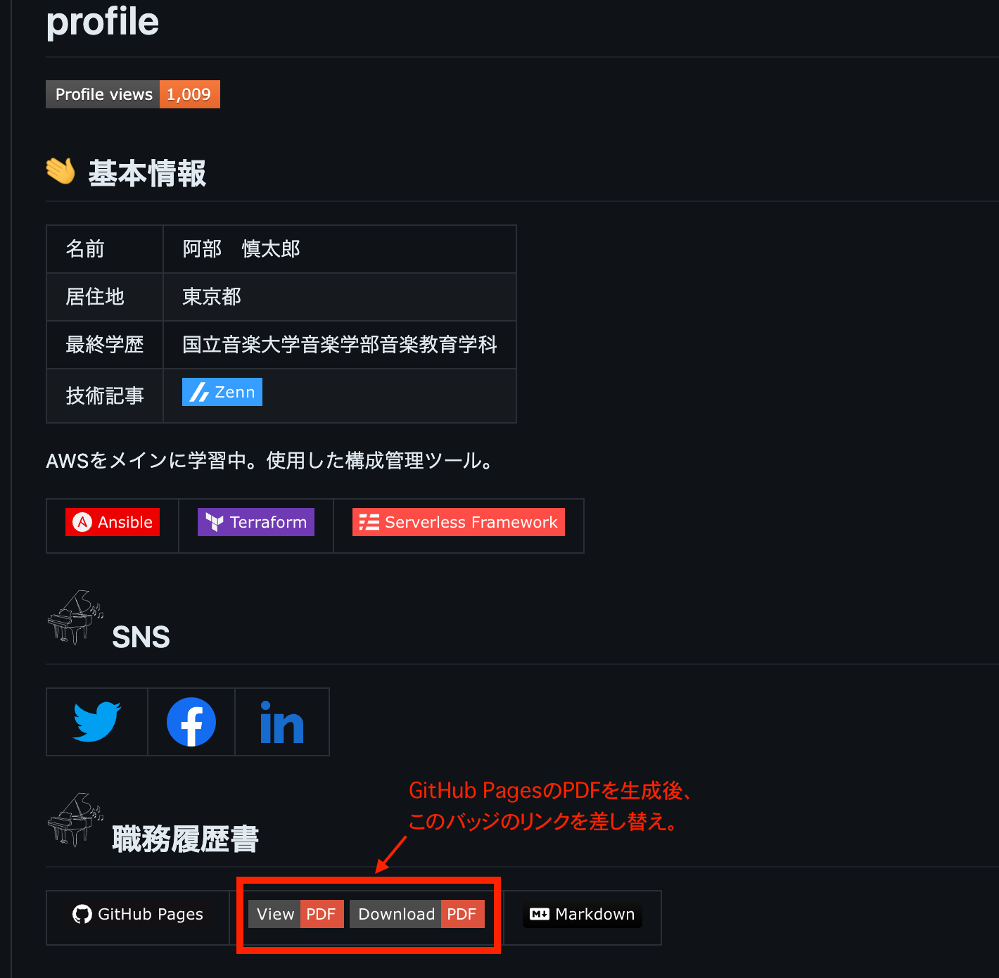

# GitHub-Pages-PDF
## 概要
- __[プロフィールリポジトリ](https://github.com/Shintaro-Abe)で使用するために作成したシェルスクリプト__
    - docsディレクトリに格納されているREADME.mdをもとにGitHub Pagesを作成。
    - 内容の更新後にPDFを生成し、ルートディレクトリに格納されているREADME.mdのバッジリンクを差し替え。
  
  
    

- __シェルスクリプトの実行__
    - GitHub Pagesの修正後、以下コマンドの実行により、PDF生成、プロフィールREADME.mdのリンク差し替え、リポジトリへのコミットとプッシュを実施。
```
bash gitpdf.sh
```
## スクリプトについて
コードは
[gitpdf.sh](gitpdf.sh)
を参照。

- __` md-to-pdf `コマンド__
    - Node.jsとyarnがインストールされている環境を構築。
    - 以下のコマンドでライブラリをインストール。
```
yarn add -D md-to-pdf
```

- __` gsed `コマンド__
    - mac環境で使用しているため、置換コマンドは` gsed -i `を使用。
    - 環境によっては` sed `コマンドで実行。
    - 置換したいコードにalt属性を付与し、キーワードとして使用。具体的なコマンドは以下。
  
```
gsed -i '/キーワード/c 置き換え後の行' 対象ファイルのパス
```
- __コミットIDの取得__
    - ` git show --format='%H' --no-patch `コマンドで最新のコミットIDを取得。

## テスト用バッジ
- __GitHubのパーマリンク__
```
https://github.com/ユーザー名/リポジトリ名/オブジェクトの種類/コミットID/path/README.pdf
```
- __各バッジのPDF取得方法__
    - view : PDFのページへ遷移。オブジェクトの種類は` blob `。
    - Download : PDFデータをローカルへダウンロード。オブジェクトの種類は` raw `。

<table>
  <tbody>
    <tr>
      <td align="left"><a href="https://github.com/Shintaro-Abe/test/blob/0150081be90829594a40ee583fa6ad184c283077/docs/README.pdf"></a> <a href="https://github.com/Shintaro-Abe/test/raw/0150081be90829594a40ee583fa6ad184c283077/docs/README.pdf"></a></td>
    </tr>
  </tbody>
</table>

## 参考資料

[pdf_configsディレクトリ](pdf-configs)のconfig.jsとstyle.cssは、船場遼さんのZenn記事を参考。

[職務経歴書をGitHubで管理するノウハウ](https://zenn.dev/ryo_f/articles/2f925f621e6d99)
